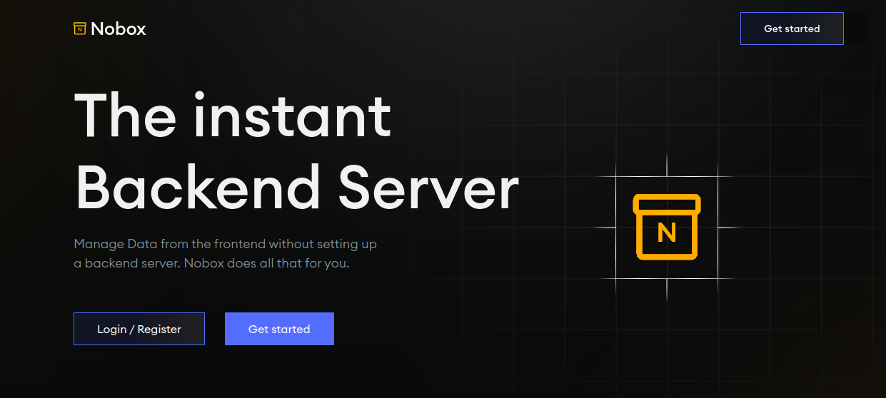
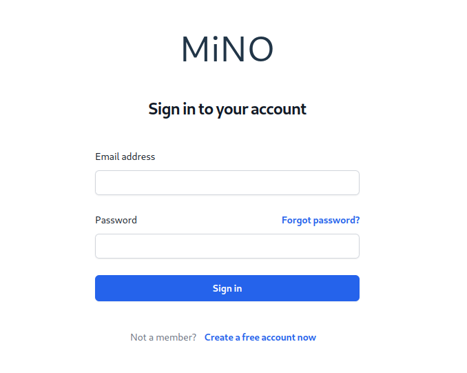
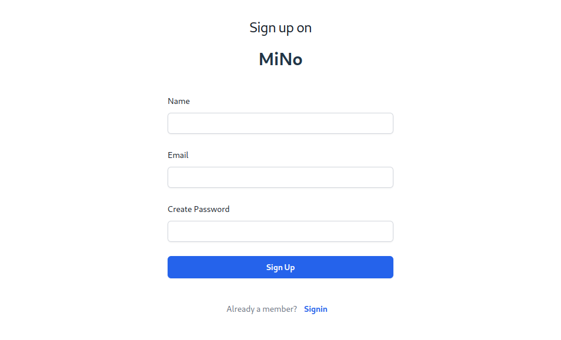
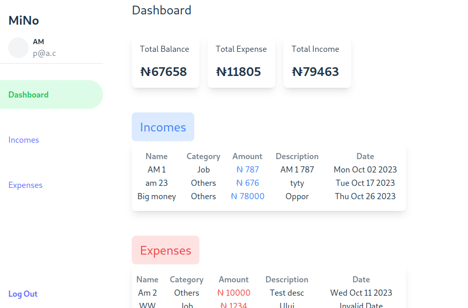
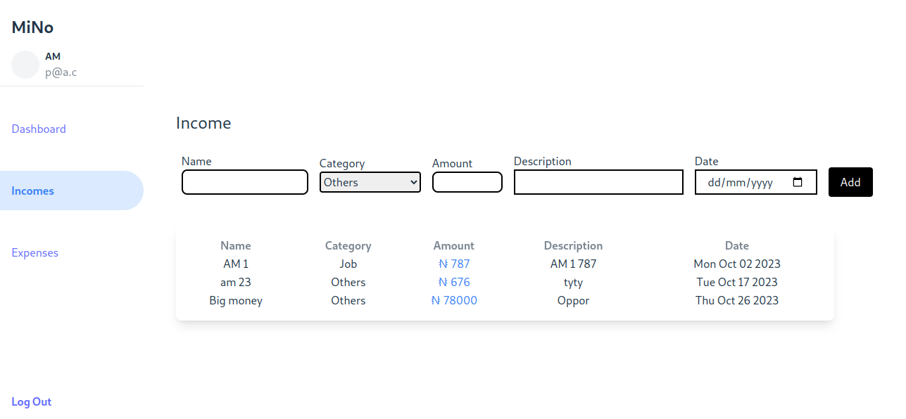
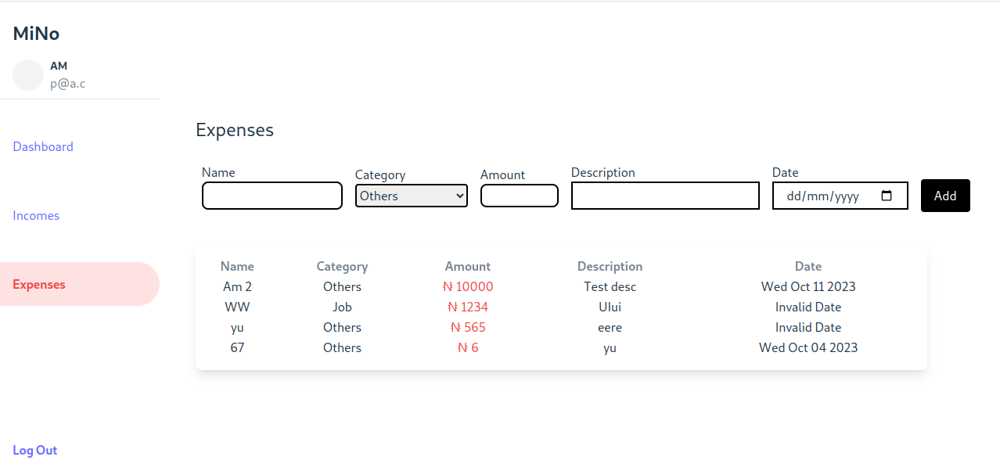

## MiNo - Expense Tracker

This is a simple Expense Tracker web app built using the [**Nobox**](nobox.cloud) BaaS service.

View live on [MiNo](https://mino-uxh5oez2.b4a.run/)

**Why use a BaaS service?**

BaaS services provide a number of benefits for web app developers, including:

* Reduced development time and costs: BaaS services provide a pre-built infrastructure and set of features, which can save you a lot of time and money on development.
* Scalability: BaaS services are typically designed to be scalable, so they can handle increases in traffic and usage without any problems.
* Security: BaaS providers typically have a strong track record of security, so you can be confident that your data is safe.

**Why use an expense tracker?**

An expense tracker can help you to:

* Track your spending and identify areas where you can cut back.
* Budget for future expenses.
* Save money for your goals.

**How to use this expense tracker**

To use this expense tracker, simply create an account and start adding your expenses. You can add expenses by category, date, and amount. You can also view your expenses in a variety of reports.

## Images
### Sign In

### Sign Up

### Dashboard

### Incomes

### Expenses
